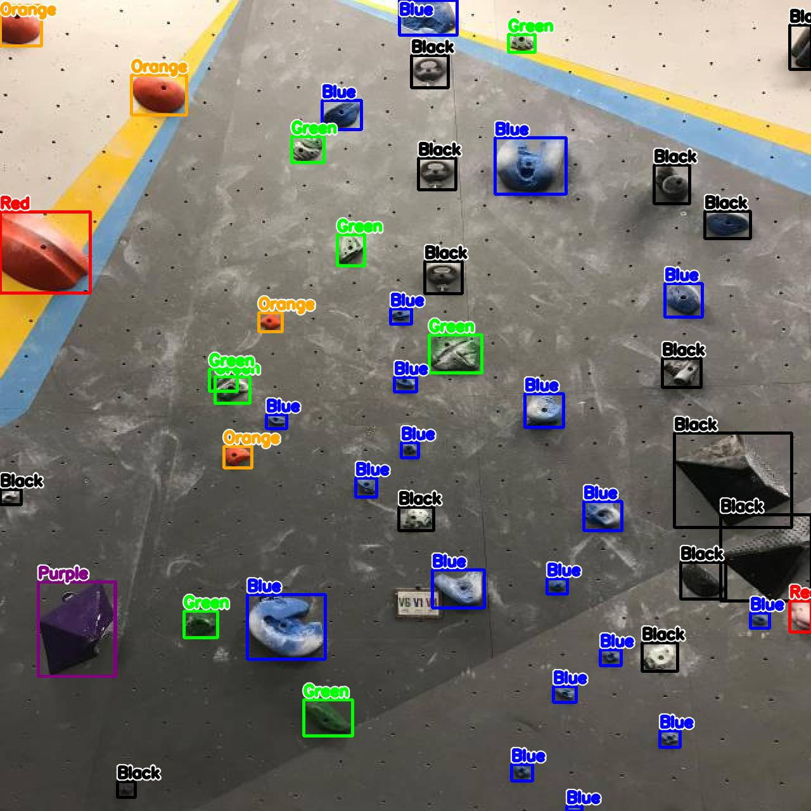
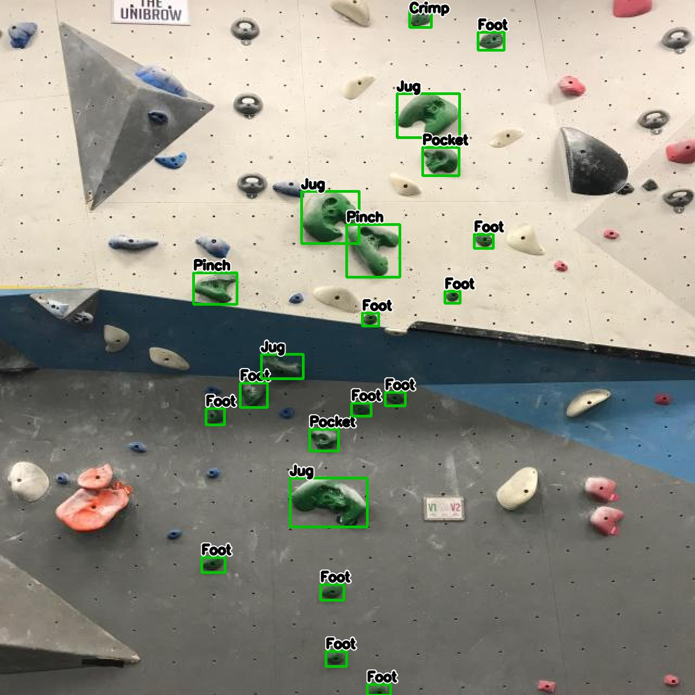
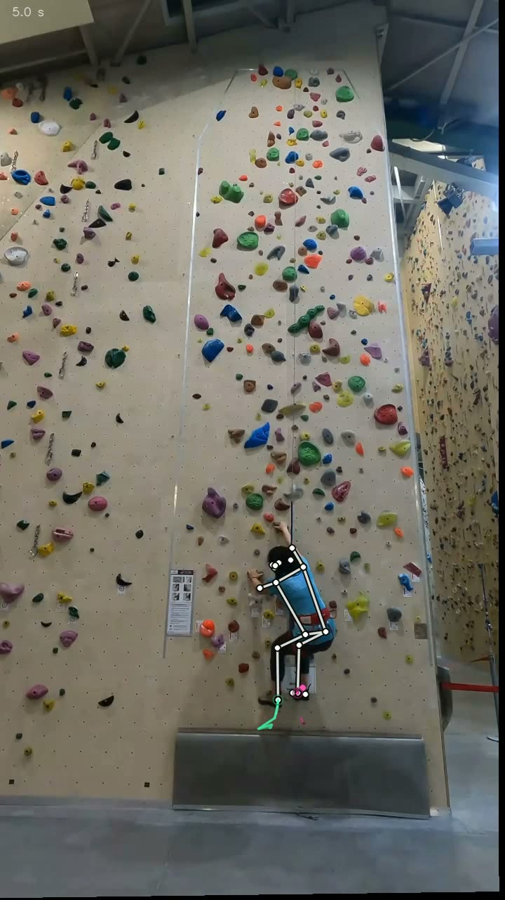
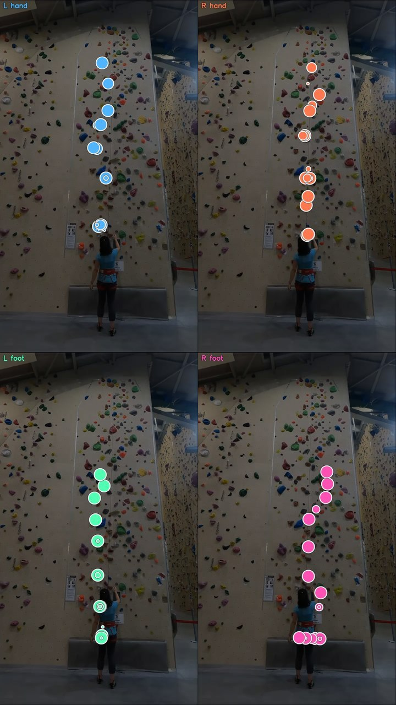

# Climbing Analysis with Deep Learning

A framework for training and running models for climbing tasks. It can analyze climbing images by segmenting and classifying holds, and process videos to generate stats like heatmaps and next-move predictions.

| Color prediction | Hold type estimation |
|------------------|----------------|
|  |  |

| Pose estimation | Movement analysis |
|------------------|----------------|
|  |  |

## Installation

```bash
pip install -r requirements.txt
```

All experiments are defined in a single YAML configuration file.

```yaml
torch:        # global torch settings
datasets:     # dataset definitions
models:       # model + pipeline configs
```

The config controls:

- datasets
- model architectures
- training hyperparameters
- inference pipelines

Each dataset must follow COCO Detection format (v2).

```yaml
datasets:
  detection:
    dir: "datasets/detection"
    val_split: 0.15
```

Datasets are referenced by models via their path.

## Training

```bash
python cli.py train <model_name> -o <output_dir>
```

Model name can be found in config.yaml

## Model Inference

```bash
python cli.py inference <model_name> \
    -w <weights_path> \
    -d <image_dir> \
    -o <output_dir> \
    [--preview]
```

## Full pipeline inference

```bash
python cli.py climb-inference \
    -m <maskformer_dir> \
    -d <image_dir> \
    -o <output_dir> \
    [options]
```

| Option                 | Description                                 |
| ---------------------- | ------------------------------------------- |
| `-c`                   | color weights                               |
| `-t`                   | type weights                                |
| `--color-model`        | color model config (default: `eva02_color`) |
| `--type-model`         | type model config (default: `eva02_type`)   |
| `--use-sam / --no-sam` | enable SAM refinement                       |
| `--sam-model`          | SAM model name                              |
| `--tta / --no-tta`     | test-time augmentation                      |
| `--score-thr`          | confidence threshold                        |
| `--preview`            | visualize results                           |


## Results

| Task                     | Metric                   | Value        |   |
| ------------------------ | ------------------------ | ------------ | - |
| **Hold-level**           | Segmentation AP@50       | **0.87**     |   |
|                          | Colour Accuracy          | **0.955**    |   |
|                          | Type Accuracy            | **0.982**    |   |
| **Route-level**          | Routes (core + possible) | **46 + 166** |   |
|                          | Event F1 (best clip)     | **0.73**     |   |
|                          | Body p95 residual        | **3.1 px**   |   |
| **Next-hold Prediction** | WED top-3 (Hybrid)       | **0.46**     |   |
|                          | Hand-ED (Hybrid)         | **0.43**     |   |
|                          | Finish Rate              | **100%**     |   |